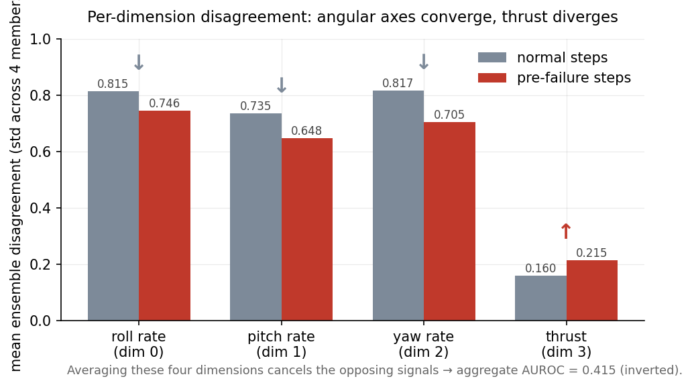
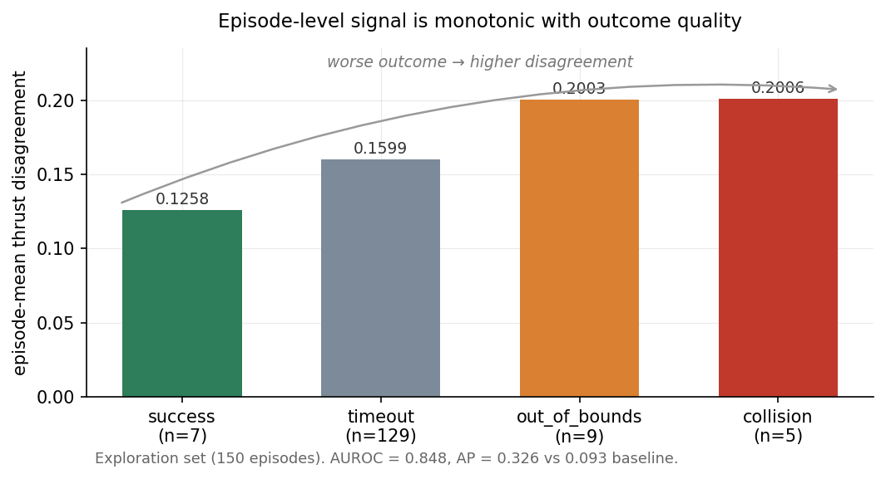
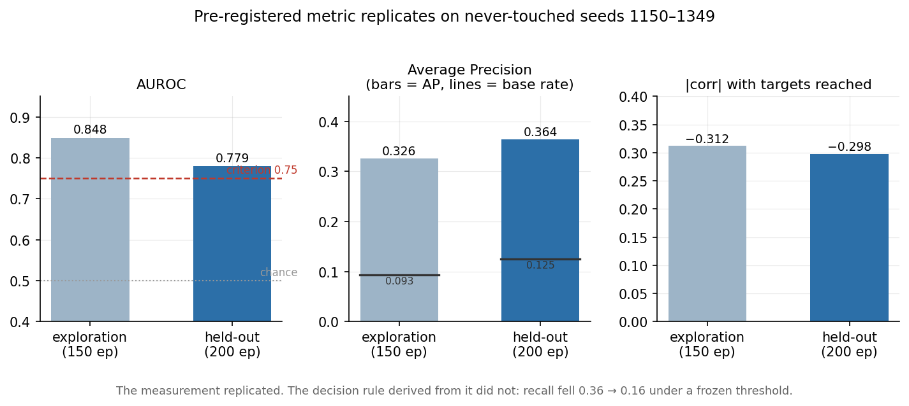

# UAV Navigation with PPO — and Three Attempts to Make the Policy Know When It Is Unsure

Waypoint navigation for a quadrotor trained with PPO, followed by three independent
attempts to attach a **policy uncertainty signal** to it: a measurement that tells the
system when its own decisions are unreliable.

Two attempts failed outright. The third produced a signal that survived a confound
control and replicated on held-out data — but did not survive conversion into a
deployable decision rule. All three are documented here, including the failures.

---

## Results at a glance

| | Result |
|---|---|
| **Navigation policy** | PPO (Stable-Baselines3), 1M timesteps, 3.00/4 waypoints, 45% full success |
| **Attempt 1 — `log_std`** | ✗ State-independent (constant 0.2348). No signal. |
| **Attempt 2 — MC Dropout** | ✗ Collision 0.5050 vs success 0.4776. Indistinguishable. |
| **Attempt 3 — Deep ensemble** | ◐ Measurement replicated (held-out AUROC 0.779, AP 2.9× baseline). Decision rule did not (recall 0.36 → 0.16). |

**The headline finding is not the AUROC.** It is that a signal can pass every
statistical test you throw at it and still fail to become a usable alarm — and that
the gap between the two is measurable in advance if you look at the right metric.

---

## 1. Why this project exists

In classification, a model reports both a prediction and a confidence, so you can ask
whether that confidence is honest (calibration, ECE, OOD flagging). In control, the
policy emits only numbers — `thrust = 0.42` — with no attached notion of certainty.

An autonomous system that fails *confidently* is far more dangerous than one that
fails while signalling doubt. This repository asks a single question:

> **Can a control policy detect, at runtime, that it is operating outside what it
> reliably learned?**

---

## 2. Task and environment

| | |
|---|---|
| Environment | `PyFlyt/QuadX-Waypoints-v4` (PyBullet quadrotor, Gymnasium API) |
| Objective | Reach 4 waypoints in sequence |
| Observation | Flattened vector — attitude, angular/linear velocity, position, motor state, delta to next waypoint |
| Action | 4-D continuous: roll rate, pitch rate, yaw rate ∈ [−π, π]; **thrust ∈ [0, 0.8]** |
| Termination | `collision`, `out_of_bounds`, `env_complete`, or 302-step timeout |

The thrust dimension is called out because every result in Part 3 turns on it.

---

## 3. The navigation policy

A PPO implementation written from scratch was tried first and **failed to learn**:
after 200k timesteps reward stayed flat at −88 and policy entropy never decreased.
The hand-written version served its purpose as a learning exercise; production
training moved to Stable-Baselines3.

**Final policy** (`models/ppo_quadx_waypoints_1M.zip`), 1M timesteps, 20 fixed
evaluation seeds:

| Metric | Value |
|---|---|
| Mean waypoints reached | 3.00 / 4 |
| Full success (4/4) | 45% |
| Collision rate | 15% |
| Out-of-bounds rate | 5% |
| Mean episode reward | 438.6 ± 189.2 |

### Negative finding — altitude reward shaping

Failure inspection showed collisions were preceded by descent, so an
`AltitudeSafetyReward` wrapper penalised proximity to the ground
(`safe_altitude` 0.3, then 0.8; `penalty_scale` 2.0; fine-tuned at `lr=1e-4` with
`target_kl=0.03` after an initial run at `3e-4` destabilised the policy).

Waypoints reached dropped **3.00 → 2.70** and the collision rate did not improve.

Per-step inspection of the attitude vector showed altitude falling smoothly and
monotonically from ~1.47 to 0 over roughly 15 steps. The failure mode was
**uncontrolled descent rate, not low altitude**. The penalty targeted a position
variable when the problem lived in its derivative, and additionally punished
legitimate low-altitude waypoint approaches.

---

## 4. Attempt 1 — the policy's own `log_std`

A Gaussian policy carries a learned standard deviation, which is tempting to read as
"how unsure the policy is here."

**Result:** constant `0.2348` at every step of every episode.

**Diagnosis:** in the standard actor-critic formulation `log_std` is a free parameter,
not a function of the observation. It is *state-independent by construction*. It can
express "this policy is generally noisy" but never "this particular state is
ambiguous." No amount of evaluation could have extracted a signal from it.

---

## 5. Attempt 2 — MC Dropout

Dropout layers were inserted into a copy of the trained policy network, weights
transferred from the 1M model, and 20 stochastic forward passes taken per state.
Uncertainty was measured as the variance of the resulting actions.

| Episode type | Mean uncertainty |
|---|---|
| Collision | 0.5050 |
| Success | 0.4776 |

The distributions overlap; the separation is not usable.

**Diagnosis:** PPO converges to a low-entropy, near-deterministic policy. Perturbing
weights in a network whose output is already sharply determined does not produce
meaningfully different actions — the perturbation is absorbed.

Training *with* dropout active was attempted to fix this and broke PPO outright:
`approx_kl = 10.5`, `clip_fraction ≈ 1.0`. Rollout collection and the update step draw
different dropout masks, so the importance-sampling ratio no longer compares the same
function to itself.

---

## 6. Attempt 3 — Deep ensemble

Both previous attempts asked *one* model to introspect. A model cannot report
uncertainty about something it learned incorrectly, because it does not know it
learned it incorrectly. The ensemble replaces introspection with **cross-examination**.

### 6.1 Setup

Four policies, trained with an identical configuration — same environment, same
reward, same hyperparameters, same 1M timesteps — differing **only in random seed**.
Configuration identity was verified byte-level from the saved model files:
hyperparameters, network class, and observation/action space bounds are identical
across all four; only the seed and its derived RNG state differ.

| Member | Final `ep_rew_mean` | Training time (CPU) |
|---|---|---|
| seed 1 | 346.1 | 66.9 min |
| seed 2 | 314.2 | 67.0 min |
| seed 3 | 302.1 | 66.9 min |
| seed 4 | 386.0 | 66.8 min |

Spread is ~25% of the mean: members are functionally distinct without any of them
being broken.

**Execution design.** Seed 1 flies; the other three observe. At each step all four
receive the same observation and produce an action, but only seed 1's action is sent
to the environment. Disagreement is therefore a **pure monitor** — it never influences
the trajectory it measures. Seed 1 was chosen by index, not by performance, to avoid
selecting the executor on the basis of results.

**Disagreement** is the per-dimension standard deviation across the four members'
deterministic actions. Deterministic prediction is essential: sampling would
reintroduce the intra-policy noise that Attempt 1 already proved carries no signal.

### 6.2 Pre-registered hypothesis — and its rejection

Registered before any evaluation was run:

> Mean disagreement across all four action dimensions separates pre-failure steps
> from normal steps, with success criterion **AUROC ≥ 0.75**.

| Label set | AUROC |
|---|---|
| Collision + out-of-bounds | **0.415** |
| Collision only | **0.384** |

Below 0.50 — not merely absent but *inverted*. **The hypothesis is rejected.**

### 6.3 Diagnosis — the aggregate metric was cancelling itself



| Dimension | Normal | Pre-failure | |
|---|---|---|---|
| roll rate | 0.8153 | 0.7456 | ↓ |
| pitch rate | 0.7351 | 0.6479 | ↓ |
| yaw rate | 0.8174 | 0.7047 | ↓ |
| **thrust** | **0.1598** | **0.2147** | **↑** |

Three dimensions converge before failure, one diverges. Averaging them destroys both.

There is also a scale defect. Angular dimensions span 6.28 rad; thrust spans 0.8. As a
fraction of its own range, thrust disagreement (0.20) is *larger* than angular
disagreement (0.13) — but five times smaller in raw units, so the mean is dominated by
the axes carrying the opposite signal. Averaging unnormalised quantities of different
scale was a design error, corrected here.

Thrust alone, step-level, collision label: **AUROC 0.687**, bootstrap 95% CI
**[0.644, 0.729]**. The lower bound excludes chance; the upper bound falls short of the
criterion.

This finding is **exploratory** — the dimension was selected after inspecting the
table. It is treated as a hypothesis to be tested, not a result, for the remainder of
this document.

The thrust axis is also where the Part 1 failure analysis independently located the
problem (uncontrolled descent rate). Two separate investigations converging on the
same physical axis is weak evidence of a real mechanism rather than a coincidence.

### 6.4 Confound control — is this just episode phase?

Failing episodes are short (mean ~160 steps); non-failing ones run to 302. A
"pre-failure" label therefore also means "inside a short episode", and if thrust
disagreement varies with flight phase the signal could be an artefact.

**Time-matched control** — compare positives only against non-failure steps at the
*same step index*:

| | AUROC |
|---|---|
| Time-matched | 0.678 |
| Unmatched | 0.687 |

**Thrust disagreement by step index** (non-failure episodes only):

| Steps | Mean |
|---|---|
| 0–49 | 0.1740 |
| 50–99 | 0.1518 |
| 100–149 | 0.1580 |
| 150–199 | 0.1526 |
| 200–249 | 0.1573 |
| 250–299 | 0.1571 |

Flat after takeoff. **The confound is ruled out; the signal is real.**

### 6.5 Real, and unusable

Base rate of pre-collision steps: **0.232%** (100 of 43,048).

| Metric | Value | Random baseline |
|---|---|---|
| AP (pre-collision) | 0.0046 | 0.0023 |

Twice random — and worthless in absolute terms:

| Recall | Precision | False alarms per true catch |
|---|---|---|
| 0.30 | 0.38% | 259 |
| 0.50 | 0.42% | 236 |
| 0.70 | 0.39% | 252 |
| 0.90 | 0.33% | 300 |

AUROC 0.687 and AP 0.0046 are not in conflict. AUROC says pre-failure steps rank
slightly higher on average; AP says no threshold turns that ranking into an alarm. At
a 0.23% base rate the two diverge completely. **Reporting AUROC alone would have
described a working system that does not work.**

### 6.6 Reframing — the deployment question is not step-level

Step-level asks *"is this instant dangerous?"* The operational question is
*"is this flight going badly — should I abort?"*

At episode level the base rate rises from 0.23% to **9.3%** — forty times better —
and per-step noise averages out.



| Outcome | n | Episode-mean thrust disagreement |
|---|---|---|
| success | 7 | 0.1258 |
| timeout | 129 | 0.1599 |
| out_of_bounds | 9 | 0.2003 |
| collision | 5 | 0.2006 |

The ordering is monotonic in outcome quality, which is stronger than binary
separation: the signal tracks *how badly* a flight is going, not just whether it ends
in a crash.

| Statistic | AUROC | AP | Baseline |
|---|---|---|---|
| **mean** | **0.848** | **0.326** | 0.093 |
| p90 | 0.708 | 0.265 | 0.093 |
| max | 0.441 | 0.085 | 0.093 |

`max` failing is informative: every flight contains a spike somewhere, including at
takeoff. What discriminates is sustained level, not peak.

Independent corroboration, using no binary label at all:

```
corr(waypoints_reached, episode-mean thrust disagreement) = −0.312
```

### 6.7 Held-out confirmation

Everything above involved choices made after looking at data. One configuration —
**episode-mean thrust disagreement** — was frozen in writing, and evaluated on
**seeds 1150–1349 (200 episodes), never previously run**.



| Metric | Exploration (150 ep) | Held-out (200 ep) |
|---|---|---|
| AUROC | 0.848 | **0.779** |
| AP | 0.326 | **0.364** |
| Baseline (base rate) | 0.093 | 0.125 |
| corr with waypoints reached | −0.312 | **−0.298** |

**The pre-registered criterion (AUROC ≥ 0.75) is met.** The drop from 0.848 is the
expected optimism penalty of the exploration set. The correlation replicating to
within 0.014 is notable because it depends on no tuned parameter.

### 6.8 From measurement to decision rule

Episode-mean is computed over the *whole* episode, including the crash. A drone in
flight cannot compute it — the score contains information that does not exist at
decision time. This is **temporal leakage**: AUROC 0.779 is a real but retrospective
measurement.

A deployable rule must look only backwards.

**Attempt A — continuous monitoring.** Running mean over the last *K* steps, warm-up
of 50 steps (justified by the step-index table in §6.4), fire when it exceeds τ:

| K | τ | Recall | False alarm | Precision | Median lead |
|---|---|---|---|---|---|
| 10 | 0.2168 | 0.79 | **0.96** | 0.08 | 125 steps |
| 25 | 0.2479 | 0.79 | 0.54 | 0.13 | 98 |
| 50 | 0.2598 | 0.50 | 0.27 | 0.16 | 74 |
| 50 | 0.2697 | 0.43 | 0.14 | 0.24 | 66 |

Warning lead times of 66–125 steps are genuinely early. But false-alarm rates are
catastrophic — structurally so: a 302-step episode offers 252 independent chances to
misfire.

**Attempt B — single causal checkpoint.** Decide once, at step *C*, using only
`mean(thrust_disagreement[50:C])`. One decision per episode, strictly causal,
implementable on hardware.

This introduces **coverage**: the fraction of failures that survive to the checkpoint
at all. A drone that crashes at step 27 cannot be helped by a decision made at step
100.

| C | τ | Recall | False alarm | Precision | Coverage |
|---|---|---|---|---|---|
| 75 | 0.1803 | 0.55 | 0.28 | 0.14 | 0.79 |
| 100 | 0.1757 | 0.73 | 0.26 | 0.18 | 0.79 |
| **100** | **0.2249** | **0.36** | **0.08** | **0.27** | **0.79** |
| 125 | 0.2150 | 0.40 | 0.08 | 0.27 | 0.71 |
| 150 | 0.2105 | 0.38 | 0.09 | 0.20 | 0.57 |

`C = 100, τ = 0.2249` was frozen and run on held-out data:

```
recall      : 0.16
false_alarm : 0.06
precision   : 0.21
coverage    : 0.76
n_fired     : 14
baseline failure rate : 0.125
precision lift        : 1.71×
```

In absolute terms, over 200 episodes: **25 failures, 19 reachable at the checkpoint,
14 alarms raised, 3 correct, 11 false, 22 failures missed.**

### 6.9 Why recall halved

τ was set at the 90th percentile of exploration scores. On held-out data the score
distribution shifted slightly, so the same *absolute* threshold no longer sat at the
90th percentile — it fired on 7.0% of episodes instead of 10.0%.

| | Exploration | Held-out |
|---|---|---|
| Episodes | 150 | 200 |
| Alarms raised | 15 | 14 |
| Fire rate | 10.0% | **7.0%** |

This is **threshold overfitting**, and it separates two claims that are easy to
conflate:

- **The measurement replicated.** AUROC, AP and the correlation all held, because
  AUROC is threshold-free.
- **The decision rule did not.** It depends on one frozen constant, and constants do
  not transfer when distributions move.

---

## 7. Honest summary

Ensemble disagreement in the thrust dimension is a **real, confound-controlled,
externally replicated** indicator of flight quality. It is **not** a deployable abort
criterion at this level of performance: 1.71× precision lift over base rate is a
measurement result, not a safety mechanism.

What the three attempts establish together:

1. Self-introspection by a single deterministic policy does not yield state-dependent
   uncertainty (Attempts 1 and 2, two different mechanisms, same conclusion).
2. Ensemble disagreement does — but only when read per-dimension. Aggregating across
   action dimensions of different scale can invert the signal entirely.
3. Rare-event detection must be evaluated with precision-recall, not ROC. The two
   metrics diverge by orders of magnitude at a 0.23% base rate.
4. Passing a discrimination threshold does not imply a working decision rule. Free
   parameters in the rule are where generalisation is lost.

---

## 8. Reproducibility

**Two environment versions are involved and they are not interchangeable.**

The Part 1 policy was trained under an older PyFlyt release producing a **24-dim**
observation; the ensemble members were trained under a newer release producing
**27-dim** observations (the wrapper was also renamed `FlattenWaypointObs` →
`FlattenWaypointEnv`, and `ClipAction` began reporting infinite action bounds, which
SB3 rejects — it is omitted, as the raw space is already bounded).

Consequences, stated plainly:

- `ppo_quadx_waypoints_1M.zip` **cannot** run in the ensemble environment. It was
  dropped from the ensemble, which is why N = 4 rather than 5.
- Part 1 metrics (3.00/4 waypoints, 15% collision) and Part 3 metrics **are not
  comparable**. They were produced by different policies in different environment
  versions.
- Under the Part 3 environment the executing member reaches full success in 4.7% of
  episodes and times out in 86%. The dominant failure mode here is not crashing but
  failing to complete the route — which is precisely why collisions are rare enough to
  create the base-rate problem in §6.5.

Ensemble environment:

```
Python 3.12.13 | Stable-Baselines3 2.9.0 | PyTorch 2.11.0+cu128
Gymnasium 1.3.0 | NumPy 1.26.4 (2.x breaks PyFlyt's compiled dependencies)
```

Training ran on CPU: for an MLP policy of this size, CPU outperformed an L4 GPU
(207 vs 170 fps) because the simulator, not the network, is the bottleneck.

Evaluation seeds: exploration `1000–1149`, held-out `1150–1349`. The held-out range
was not executed until the hypothesis was frozen.

---

## 9. Repository structure

```
├── notebooks/
│   ├── 01_ppo_training.ipynb          # policy training + reward shaping study
│   └── 02_ensemble_uncertainty.ipynb  # ensemble, analysis, held-out test
├── models/
│   ├── ppo_quadx_waypoints_1M.zip     # Part 1 policy (obs=24, legacy env)
│   └── ensemble/
│       └── seed{1,2,3,4}.zip          # ensemble members (obs=27)
├── figures/
└── requirements.txt
```

---

## 10. Limitations and future work

- **Five collision episodes** in the exploration set. Confidence intervals are wide;
  the held-out set roughly doubles the failure count but this remains a small-sample
  study.
- **N = 4** members. Five or more would reduce variance in the disagreement estimate,
  though sample size, not ensemble size, was the binding constraint here.
- **Absolute threshold.** Defining τ as an online percentile of recent flights rather
  than a fixed constant would let it track distribution shift — the most direct fix
  for §6.9.
- **Single executor.** Whether disagreement predicts failure for a policy that is
  itself the ensemble mean is untested, and would change the causal interpretation.
- **One environment.** Whether the thrust-axis result generalises to other dynamics is
  unknown.

---

## 11. Related

- [`rl-fundamentals`](https://github.com/baturalpoz06/rl-fundamentals) — DQN and PPO
  implemented from scratch on CartPole
- [`model-reliability-analysis`](https://github.com/baturalpoz06/model-reliability-analysis) —
  the same reliability question in a computer vision setting (ECE, confidence
  thresholding, error anatomy)
